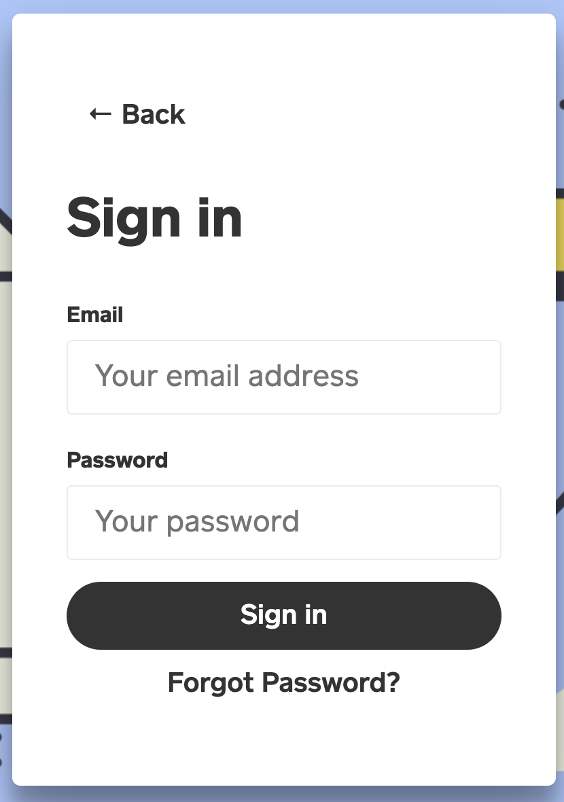
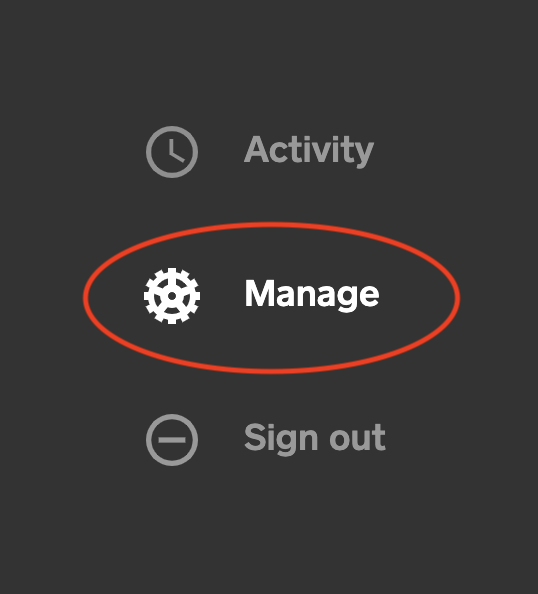
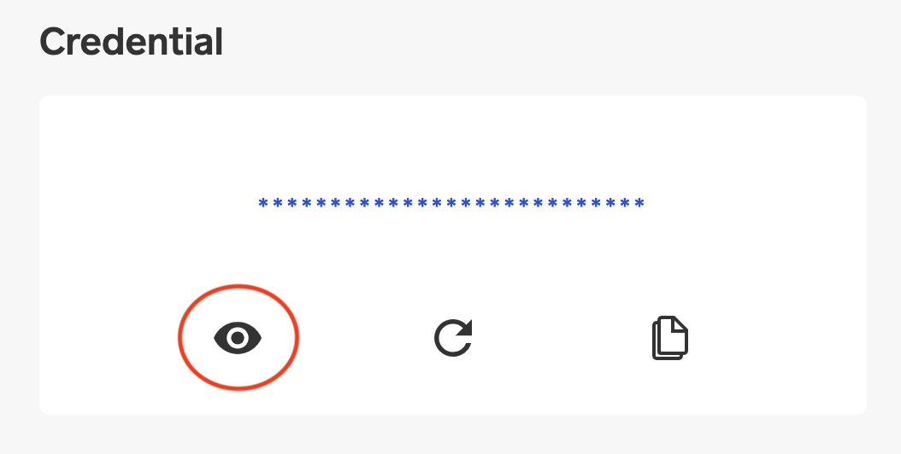

# 🔑 Getting Your API Key

On signup, every user is automatically assigned a unique API key, which can easily be accessible from the Dashboard. The steps have been outlined below:


**Security**: API keys are expected to be kept securely. If for any circumstance you suspect any case of key theft, simply [regenerate a new key](regenerate-api-key.md).



See [Authorization](./) on how to use the API keys.


#### Step 1:

Login to your dashboard.

#### Step 2:

Switch to the **Manage** tab on your dashboard.

#### Step 3:

Click the eye icon \(👁\) located beside your current key.

That is all.

