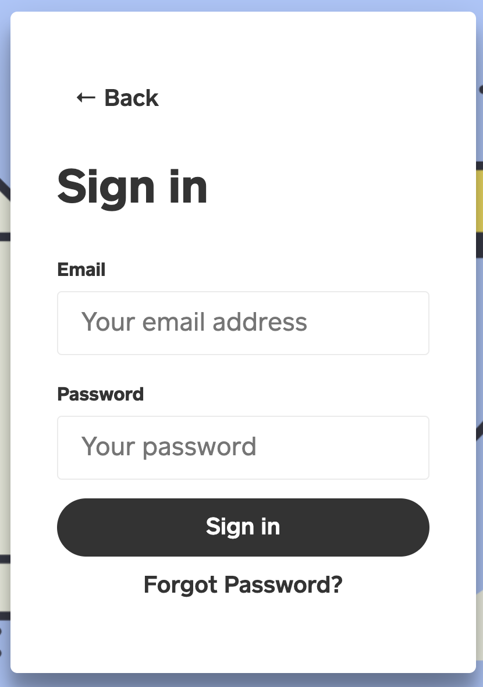
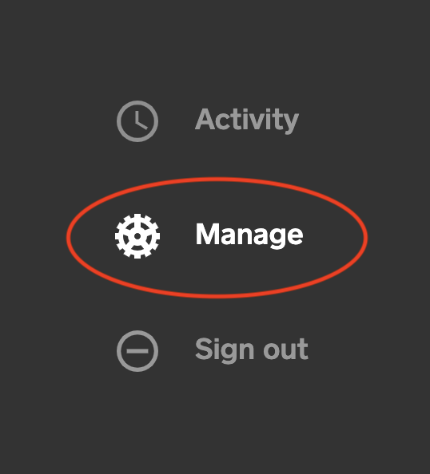

# ♻️ Regenerate API Key

Generating a new API key is something that can easily be done via the dashboard in a few steps. The steps have been outlined below:


**Notice:** Do note that once you regenerate an API key, you automatically revoke the previous key. Hence, it's important that you manually update all existing environments where the previous key was utilized. 



See [Authorization](./) on how to use the API keys.


#### Step 1:

Login to your dashboard.

#### Step 2:

Switch to the **Manage** tab on your dashboard.

#### Step 3:

Click the regenerate icon \(♻\) located beside your current key.

That's all.

